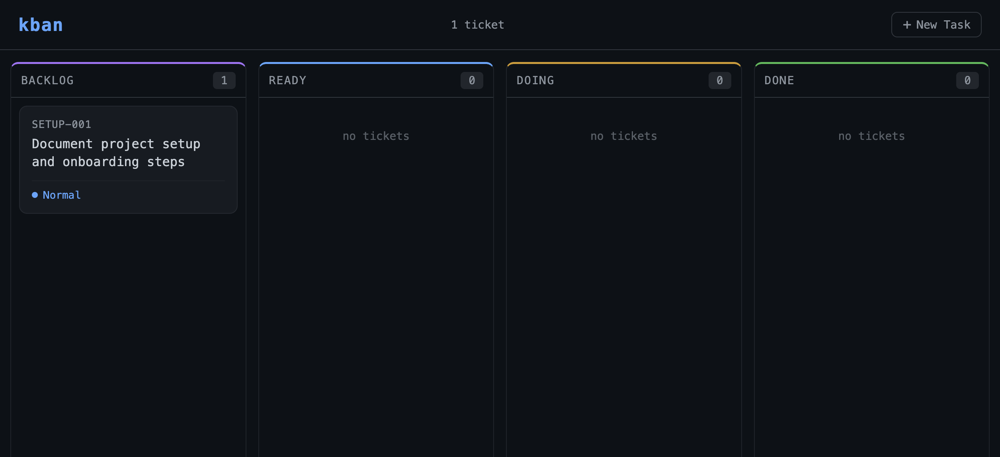

# homebrew-kban

Homebrew tap for [kban](https://github.com/davidpellerin/homebrew-kban) — a simple filesystem-based kanban board for AI tooling such as Claude Code.

## Install

```bash
brew tap davidpellerin/kban
brew install kban
```

## Getting Started

Navigate to your project directory and run:

```bash
kban init                       # Scaffold the kanban board (.kban/work/ structure)
kban install skill claude       # Install the kban skill for Claude Code
```

This creates the board structure and a sample backlog ticket to get you going.

## Example

```
$ kban board

BACKLOG (1)             READY (2)               DOING (1)               DONE (1)
──────────────────────  ──────────────────────  ──────────────────────  ──────────────────────
003-Add-Pagination      001-Setup-API           002-Create-UI           000-Init-Project
                        004-Write-Tests
```

## Tickets

Tickets are plain markdown files with a small YAML frontmatter block. Drop them in the appropriate lane folder under `.kban/work/`.

```markdown
# .kban/work/ready/001-Setup-API.md
---
title: Setup API
priority: high
depends_on: []
---

## Goal

Scaffold the Express app and define the base route structure.

## Tasks

- [ ] Initialize the project with package.json
- [ ] Add Express and basic middleware
- [ ] Define /health and /api/v1 routes
```

Tickets support a `blocked` field to indicate work stalled on an external dependency. Blocked tickets are highlighted in red in the web UI and tagged `[BLOCKED]` in CLI output:

```markdown
---
title: Integrate Payment API
priority: high
depends_on: []
blocked: true
---
```

Tickets can also declare dependencies on other tickets — kban will automatically promote them to `ready` once their dependencies are done:

```markdown
# .kban/work/backlog/002-Create-UI.md
---
title: Create UI
priority: high
depends_on: [001-Setup-API]
---

## Goal

Build the frontend dashboard that connects to the API.
```

When `001-Setup-API` is marked done, `002-Create-UI` moves to `ready` automatically.

## Usage

```
kban version             # Show kban version
kban board               # Show the board overview
kban list [lane]         # List tickets in a lane (or all lanes)
kban show <id>           # Show ticket details
kban next                # Show the next actionable ticket (ready + deps met)
kban start <id>          # Move ticket to doing
kban done <id>           # Mark ticket as done (auto-promotes backlog tickets)
kban move <id> <lane>    # Move ticket to any lane
kban serve               # Start the web UI at http://localhost:8080
```

Lanes: `backlog`, `ready`, `doing`, `done`

### Web UI

```bash
kban serve
# or with custom host/port:
KBAN_HOST=0.0.0.0 KBAN_PORT=9000 kban serve
```

Opens a minimal browser interface at `http://localhost:8080` showing the board. Requires Python 3 (no extra packages needed).



## Sample Prompts (Claude Code)

After running `kban install skill claude`, try these in Claude Code:

```
show the board
```
```
what's next?
```
```
start the next ticket and implement it
```
```
what's blocked and why?
```
```
use the kban skill to work on all tasks that are Ready and use the most appropriate agents & subagents
```

## License

MIT © [David Pellerin](https://github.com/davidpellerin)
