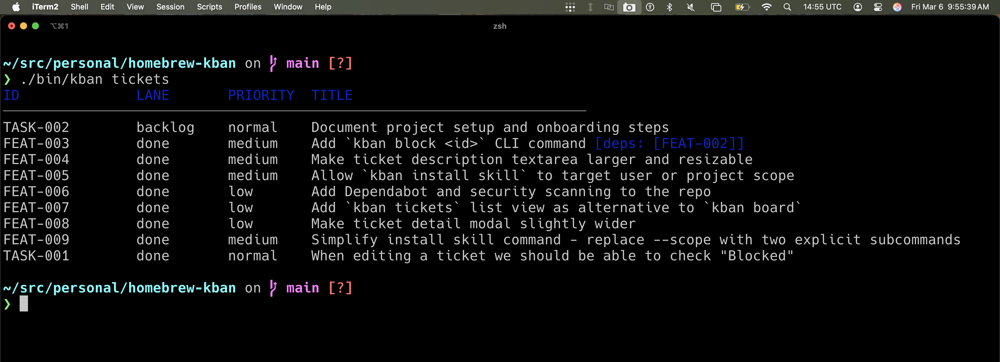
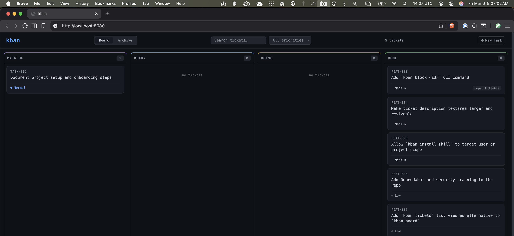
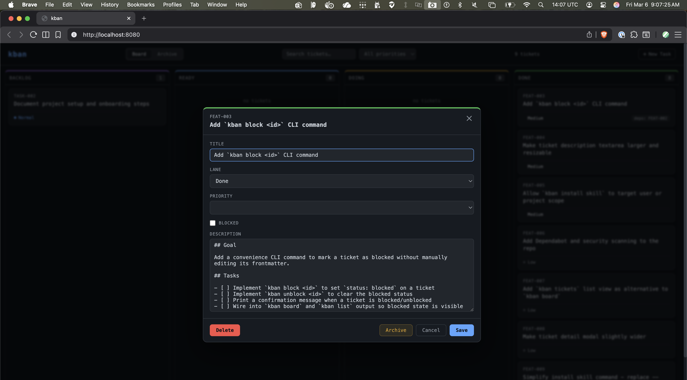
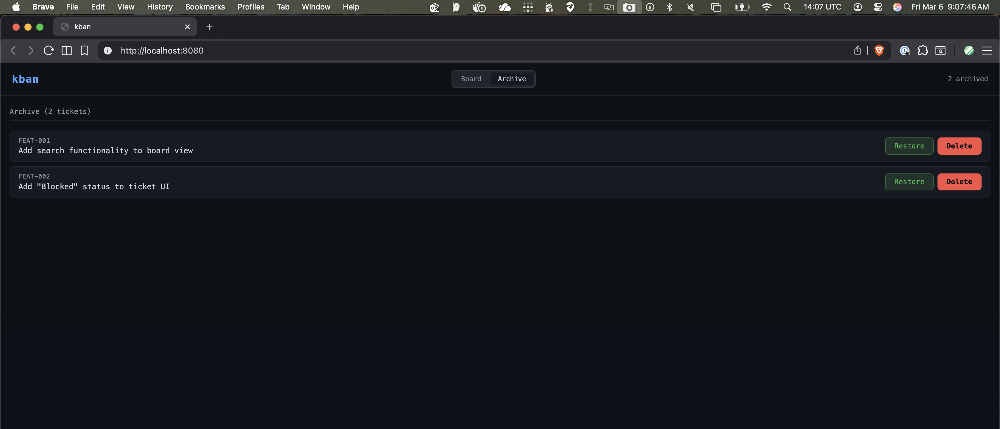

# homebrew-kban

Homebrew tap for [kban](https://github.com/davidpellerin/homebrew-kban) — a simple filesystem-based kanban board for AI tooling such as Claude Code.

## Install

```bash
brew tap davidpellerin/kban

brew install kban
```

## Getting Started

Navigate to your project directory and run:

```bash
$ cd myproject

$ kban init                       # Scaffold the kanban board structure

$ kban install skill project      # Install the kban skill for this project
```

This creates the board structure, a sample backlog ticket, and a the `/kban` skill for Claude Code.

## Usage

```
kban - Simple filesystem-based kanban board

Usage: kban <command> [arguments]

Commands:
    version                     Show kban version
    init                        Create .kban folder structure in current directory
    install skill user          Install Claude Code skill for your user account (all projects)
    install skill project       Install Claude Code skill for this project only
    board                       Show the board overview
    list [lane]                 List tickets in a lane (or all lanes)
    show <id>                   Show ticket details
    next                        Show the next actionable ticket (ready + deps met)
    start <id>                  Move ticket to doing
    done <id>                   Mark ticket as done
    promote                     Move eligible backlog tickets to ready
    move <id> <lane>            Move ticket to any lane
    block <id>                  Mark ticket as blocked
    unblock <id>                Clear blocked status from ticket
    archive <id>                Move ticket to archive (hidden from board)
    unarchive <id>              Restore ticket from archive to done
    tickets [lane]              Flat list of all tickets with lane/priority/deps
    serve                       Start the web UI (default: http://localhost:8080)

Lanes: backlog, ready, doing, done, archive
```

## Example

```
$ kban board

BACKLOG (1)             READY (2)               DOING (1)               DONE (1)
──────────────────────  ──────────────────────  ──────────────────────  ──────────────────────
003-Add-Pagination      001-Setup-API           002-Create-UI           000-Init-Project
                        004-Write-Tests
```

## Tickets

Tickets are plain markdown files with a small YAML frontmatter block. Drop them in the appropriate lane folder under `.kban/work/`.

```markdown
# .kban/work/ready/001-Setup-API.md
---
title: Setup API
priority: high
depends_on: []
---

## Goal

Scaffold the Express app and define the base route structure.

## Tasks

- [ ] Initialize the project with package.json
- [ ] Add Express and basic middleware
- [ ] Define /health and /api/v1 routes
```

Tickets support a `blocked` field to indicate work stalled on an external dependency. Blocked tickets are highlighted in red in the web UI and tagged `[BLOCKED]` in CLI output:

```markdown
---
title: Integrate Payment API
priority: high
depends_on: []
blocked: true
---
```

Tickets can also declare dependencies on other tickets:

```markdown
# .kban/work/backlog/002-Create-UI.md
---
title: Create UI
priority: high
depends_on: [001-Setup-API]
---

## Goal

Build the frontend dashboard that connects to the API.
```


### Screenshots

#### CLI Ticket List


#### Web UI


#### Editing a Ticket


#### Archive View



## Sample Prompts

After running `kban install skill claude`, try these prompts:

```
show the board
```
```
what's next?
```
```
start the next ticket and implement it
```
```
what's blocked and why?
```
```
use the kban skill to work on all tasks that are Ready and use the most appropriate agents & subagents
```

## License

MIT © [David Pellerin](https://github.com/davidpellerin)
